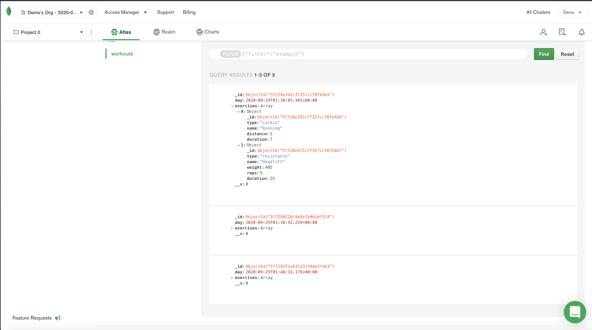

# fitAF
* A way to track your workouts
* Able to enter resistance training and cardiovascular training
* Once the workout is completed you are able to see your last workout on the home page

# Table of Contents

* [Process](#Process)
* [Issues](#Issues)
* [Future Plans](#Future-Plans)
* [Video](#Video)
* [Link](#Link)
* [Screenshot](#Screenshot)

# Process

# Issues
 * Difficulty connecting to mongodb
 * Had a hard time connecting it to heroku
 * Figuring out how to display stats

# Future-Plans

# Link 

[Link to fitAF](https://fitaf.herokuapp.com/)

# Screenshot

